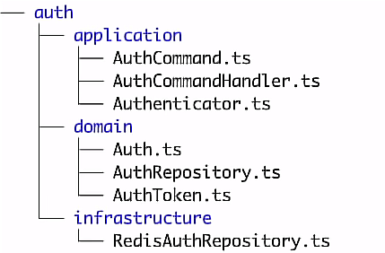

# Reto para AtomChat 

Este reto es un backend donde podemos consultar tareas o "Tasks" donde el manejo de los datos lo utilizamos con Firebase con Firestore.

## Aspectos a evaluar 

- **Conocimiento de Firebase y TypeScript:** 
    - **Resumen:** Se implemento la configuracion de firebase, firestore tanto en la consola de firebase como en el backend con Typescript y se implemento el uso de interface Task y para agregarle un extra se utilizo un extends para utilizar el id en el getList.
 
- **Diseño y estructura del proyecto:** el punto se desarrolla [AQUI](#seccion-arquitectura) 
 
- **Modelado de datos:** el punto se desarrolla [AQUI](#seccion-datos) 
 
- **Implementación de la API:** el punto se desarrolla [AQUI](#seccion-apis) 
 
- **Validaciones:** Se utilizo un middleware para validar la estructura de datos enviada tanto en Post como en Put

- **Pruebas:** La implementación de pruebas se enfoco en los dos archivos mas importantes **taskController** y **taskUsecase** con 16 pruebas.

- **Tecnologías:** express, express-validator, firebase, typescript, jest

- **Extras:** Se agrego un estandar de smart commits, revision de dependencias, revision de linter y revision de test antes de enviar por git cualquier feature de la mano de husky que automatiza el proceso. 
 

## Ingreso al proyecto online

- **Url:**  


## Levantar el proyecto en local ##
 
- **backend:**
  - pnpm run install 
  - pnpm run start
  - url: http://localhost:5000/api/v1 
  
  

## Arquitectura del Sistema
<div id="seccion-arquitectura"></div>

El sistema se compone de la combinación de 4 tipos de arquitectura:

- **Clean Architecture**
    - **Ventaja:** Proporciona una estructura modular y desacoplada, lo que facilita la comprensión y el mantenimiento del código. Permite la independencia de las capas, lo que facilita la realización de pruebas unitarias y la sustitución de componentes.
    
    - **Desventaja:** La implementación de Clean Architecture puede requerir un tiempo adicional en comparación con enfoques menos estructurados. La estricta separación de responsabilidades puede resultar en una mayor complejidad inicial y requerir un mayor esfuerzo de diseño.
    
    
    
- **Hexagonal Architecture**

    - **Ventaja:** Proporciona un alto nivel de modularidad y desacoplamiento al separar claramente las dependencias internas y externas de una aplicación. Esto facilita las pruebas unitarias, el reemplazo de componentes y la adaptación a cambios en los requisitos externos.
    
    - **Desventaja:** La implementación de Hexagonal Architecture puede ser compleja y requerir un enfoque cuidadoso en el diseño inicial. La adición de adaptadores y puertos puede aumentar la complejidad del código, especialmente en aplicaciones pequeñas o simples.
    
    
    
- **Vertical Slicing**

    - **Ventaja:** Permite desarrollar y entregar funcionalidades completas y listas para usar de forma más rápida y eficiente. Facilita la colaboración y la comunicación entre los miembros del equipo al enfocarse en una característica específica en lugar de en capas o componentes individuales.
    
    - **Desventaja:** La implementación de Vertical Slicing puede resultar en una mayor complejidad en comparación con enfoques más tradicionales, ya que implica la coordinación y el manejo de múltiples flujos de trabajo simultáneos. Requiere una planificación cuidadosa y una comunicación efectiva entre los miembros del equipo.
    
    
    
- **Screaming Architecture**

    - **Ventaja:** Promueve una arquitectura enfocada en los conceptos clave y los casos de uso principales de la aplicación. Proporciona una estructura clara y expresiva que facilita la comprensión del propósito y la funcionalidad de cada componente.
    
    - **Desventaja:** La implementación de Screaming Architecture puede requerir una mayor planificación y diseño inicial, ya que se basa en la identificación y la definición de conceptos y casos de uso clave. Puede ser menos flexible en comparación con enfoques más generales, lo que puede dificultar la adaptación a cambios o requisitos adicionales en el futuro.
    
    

## Estructura final

```
- src
    - constants
    - modules
        - Task
            - adapters
                - controllers
                - repositories
                - validations
            - application
                - adapters
                - usecases
            - domain
                - models
                - repositories
            - infrastructure
                - data
                    - firebase
    - shared
        - config
        - firebase
 index.ts
 routes.ts 
- tests 
  - Task
    - taskController.test.ts 
    - taskUsecases.test.ts
``` 
 
 
## Modelo de datos

<div id="seccion-datos"></div>

**Task**
```
* title (STRING, nulo)
* description (STRING, longitud máxima 255, nulo)
* completed (BOOLEAN, True - False, no nulo)
```

**TaskWithId** 
```
* id (INTEGER, id documento, uuidv4)
```

## Endpoints

<div id="seccion-apis"></div> - Lista de endpoints

```
taskRouter.get('/api/v1/tasks/', getTasksController);
taskRouter.post('/api/v1/tasks/', validateTask, createTaskController);
taskRouter.put('/api/v1/tasks/:taskId', validateTask, updateTaskController);
taskRouter.delete('/api/v1/tasks/:taskId', deleteTaskController);
```

## Decisiones Tomadas

Al inicio del proyecto se considero utilizar solo una arquitectura con alguna buena practica de clean arquitecture no obstante considere llevarlo a un entorno donde desacoplar y poder escalar modulos a futuro me parecio mas adecuado ya que mi intencion es que el proyecto pueda utilizarse sin la atadura estructural de la arquitectura hexagonal no obstante se agrego un pequeño versionamiento a los enpoints v1 ya que en mi experiencia puede ser muy util cuando queremos darle una comparacion de rendimiento o algun cambio fuerte a un endpoint. 

Adicionalmente se ha agregado una carpeta shared donde podrian incluir otros modelos de BD como por ejemplo MongoDB, Mysql, DynamoDB u algun otro gestor de datos.


 


